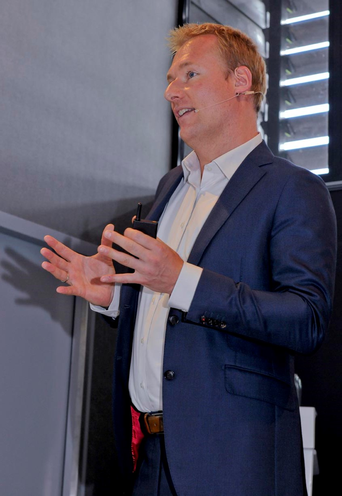

---
# An instance of the Blank widget.
# Documentation: https://sourcethemes.com/academic/docs/page-builder/
widget: blank

# Activate this widget? true/false
active: true

# This file represents a page section.
headless: true

# Order that this section appears on the page.
weight: 2

title: Speaking
subtitle:

design:
  columns: "1"
  spacing:
    padding: ["20px", "0", "20px", "0"]
---

<table width="1000px">
    <tr>
        <td width="600px"></td>
        <td width="400px">
Rik is a frequent keynote speaker at (international) conferences and (executive) seminars and has given numerous talks on leadership in our digital disruptive world, Agile at scale, DevOps transformations, and organizational and digital transformations.

    
He can be contacted for a speaking opportunity. Due to COVID19 Rik is able to resort to virtual events and talks when required.
</td></tr></table>

test

test

test



#### Selected Talks

<table width="500px">
    <tr>
        <td width="100px">Lorum ipsum doles</td>
        <td width="400px"><iframe src="https://www.youtube.com/embed/XujJZxfeCaM?autoplay=1" allowfullscreen title="YouTube Video"></iframe></td></tr>
    <tr><td width="100px">Test zin om tabel goed te krijgen</td>
        <td width="400px"><iframe src="https://www.youtube.com/embed/XujJZxfeCaM?autoplay=1" allowfullscreen title="YouTube Video"></iframe></td></tr></table>

